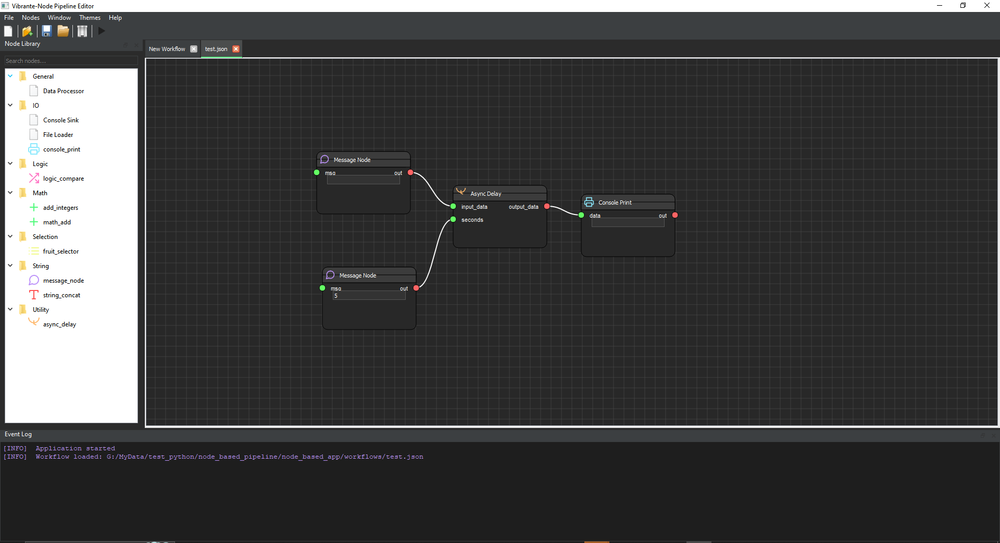
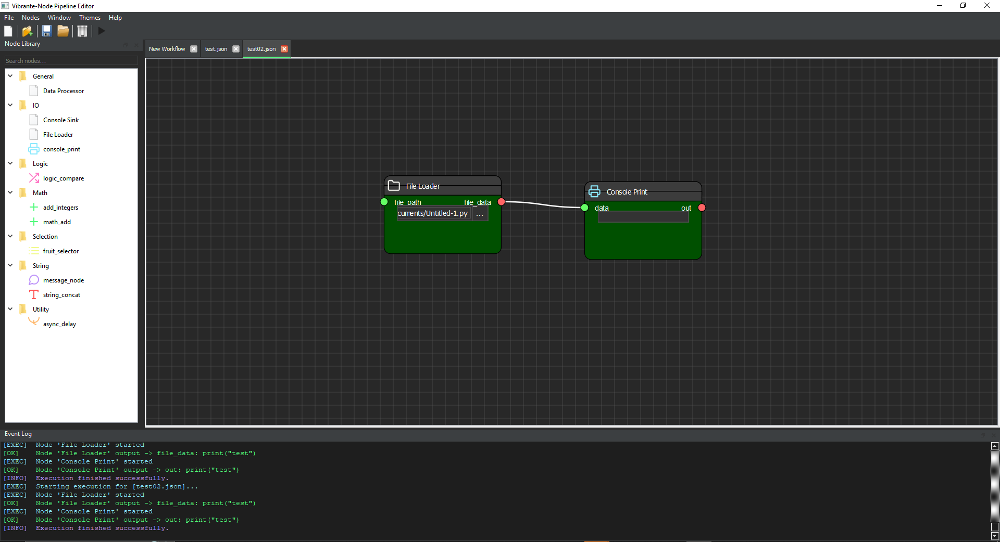
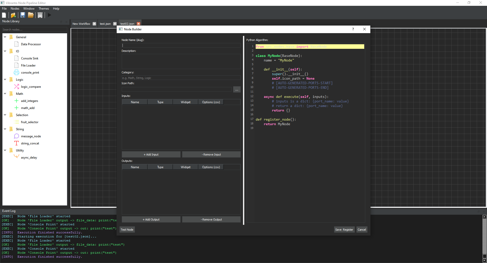

# Vibrante-Node

**Vibrante-Node** is a Python-node-based visual framework for building modular systems through connected nodes and data flows. It provides an intuitive graph interface where complex logic can be constructed visually by linking nodes together.

The project focuses on flexibility, extensibility, and developer productivity, making it suitable for building tools such as visual pipelines, automation workflows, and data-processing graphs. Node-based systems allow complex operations to be organized as interconnected components rather than traditional linear code structures, improving clarity and scalability in large workflows.

---

## 📸 Screenshots





---

## 🌟 Latest Enhancements

### 🎨 Visual Overhaul & Theming
*   **Dynamic Dark/Light Themes:** Fully integrated theme switching across the entire application, including the canvas and all dock panels.
*   **Category-Based Coloring:** Nodes are automatically color-coded based on their category (Math, Logic, Data, etc.) for instant visual identification.
*   **Refined Node Layout:** Nodes automatically scale to fit their content with perfectly centered widgets and clear headers.

### 🔌 Type-Coded Ports
*   **Visual Data Types:** Ports are color-coded by data type (e.g., Cyan for `int`, Purple for `string`), making connections intuitive and error-resistant.
*   **Interactive Tooltips:** Hover over any port to see its name and expected data type instantly.

### 🤖 Automation Suite
*   **Power-User Examples:** 11 new Python scripts demonstrating batch processing, scene management, and complex workflow automation.
*   **Scripting Console:** Full access to the internal API for programmatically manipulating the node graph.

### 📊 Interactive Status Bar
*   **Real-time Feedback:** Monitor execution status and get detailed descriptions of selected nodes directly in the status bar.

### 🏗️ Advanced Node Builder
The specialized creation tool is now more powerful:
- **Interactive Selectors:** Dropdown menus for selecting port **Types** and **Widget** styles.
- **Automatic Code Generation:** Generates full Python class structures with lifecycle stubs automatically.
- **Robust Sync:** Bi-directional synchronization between the UI tables and the Python source code.

### ⚡ Reactive Data Propagation
Workflow data now flows in **real-time** across the canvas:
- **Instant Sync:** Changing a value in one node immediately updates all connected downstream nodes.
- **Visual Monitoring:** Destination widgets update live even when disabled by a connection, acting as real-time monitors.
- **Predictive Flow:** Smart data mirroring ensures nodes possess output data even before the full workflow is executed.

---

## 🚀 Key Features

- **Interactive Node Widgets:** Embed Text Boxes, Sliders, Dropdowns, and File Selectors directly into your nodes.
- **Thread-Safe Logging:** Background nodes communicate with the UI via a robust signal-based logging system.
- **Asynchronous Engine:** Background execution via `asyncio` keeps the UI responsive during high-load processing.
- **Robust Persistence:** Workflows and custom nodes are saved as clean, portable JSON definitions.

---

## 📥 Installation & Setup

### Prerequisites
- Python 3.10+
- `pip`

### Setup
1. **Clone the repository:**
   ```bash
   git clone https://github.com/KamalTD/Vibrante-Node.git
   cd Vibrante-Node
   ```

2. **Install dependencies:**
   ```bash
   pip install -r requirements.txt
   ```

3. **Run the App:**
   ```bash
   python ./src/main.py
   ```

---

## 📚 Documentation

Detailed documentation is available for both users and developers:
-   📖 **[User Guide](USER_GUIDE.md)**: How to use the interface and build workflows.
-   🛠️ **[Node Builder API](NODE_BUILDER_API.md)**: In-depth guide for creating custom nodes.
-   🤖 **[Automation API](AUTOMATION_API.md)**: Reference for Scripting Console automation.
-   🛠️ **[Developer Documentation](DEVELOPER.md)**: Technical architecture and internal data flow.
-   📄 **[Technical Feature List](DOCUMENTATION.md)**: Detailed breakdown of all platform features.

---

## 📂 Project Structure

```text
├── nodes/              # JSON definitions for custom nodes
├── src/
│   ├── core/           # Engine, Registry, and Graph logic
│   ├── ui/             # PyQt components (Canvas, Editor, Library)
│   ├── utils/          # Runtime and Threading helpers
│   └── main.py         # Application entry point
├── workflows/          # Saved pipeline files (.json)
└── DOCUMENTATION.md    # Full technical feature list
```

---

## 📜 License
This project is provided for educational and developmental purposes. Feel free to fork and extend!
