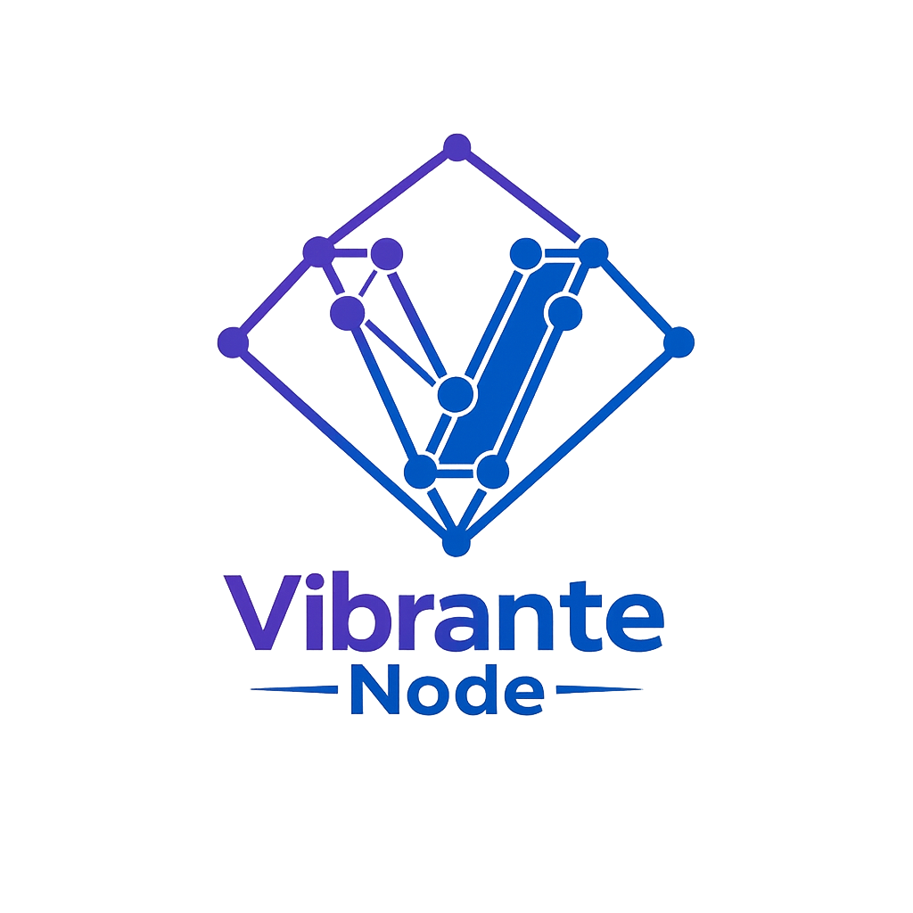
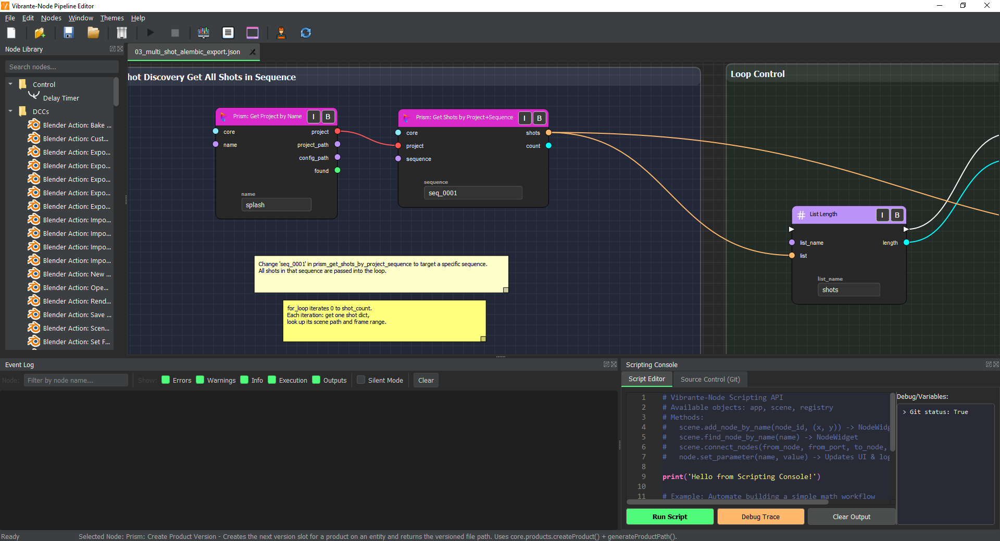
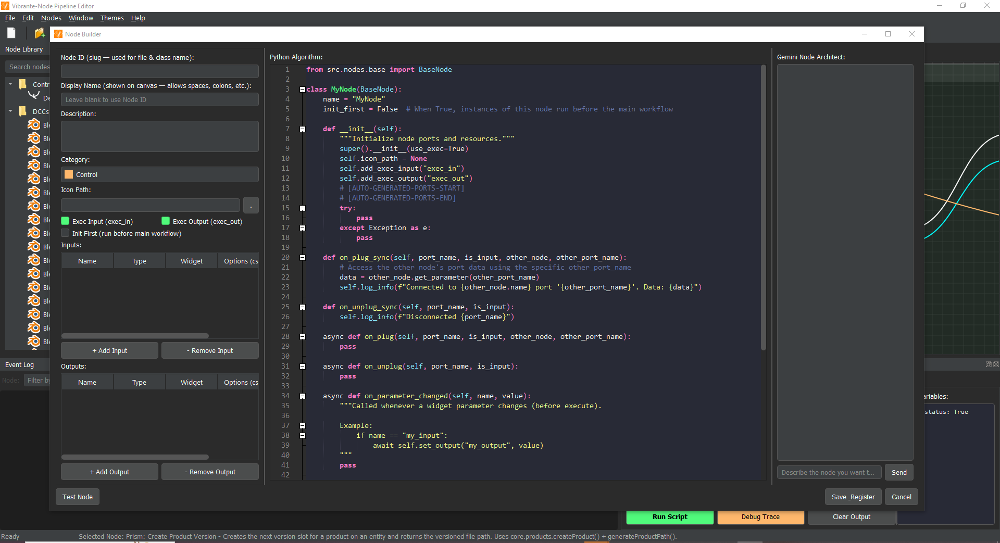
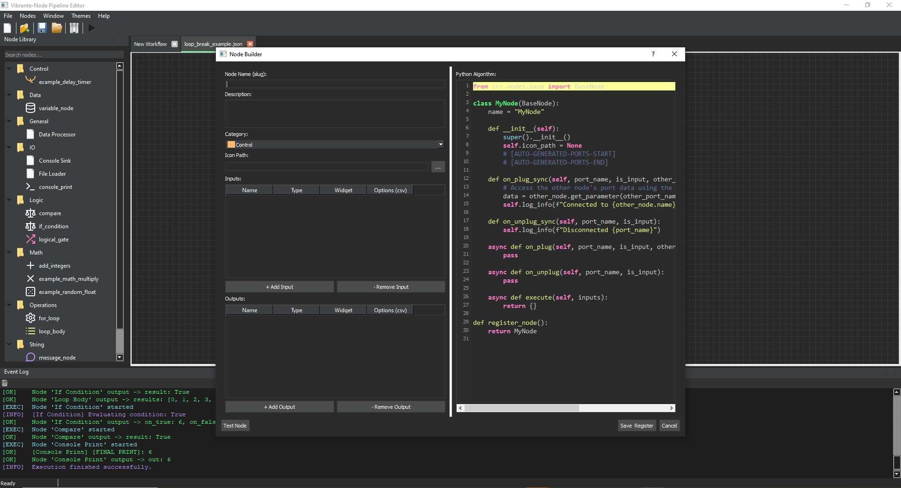
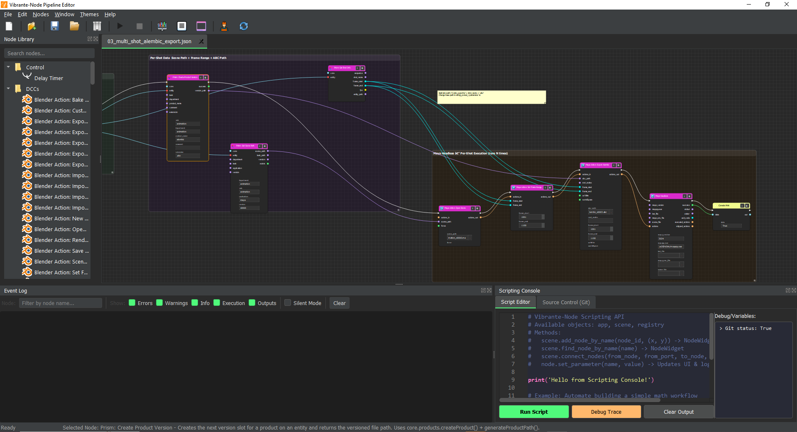
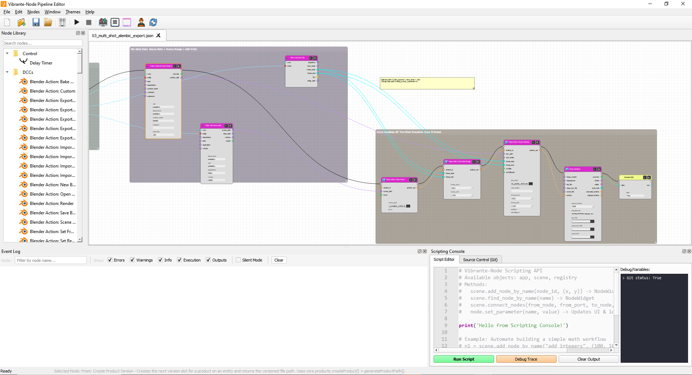

<p align="center">
  
</p>

# Vibrante-Node

**Vibrante-Node** is a Python-node-based visual framework for building modular systems through connected nodes and data flows. It provides an intuitive graph interface where complex logic can be constructed visually by linking nodes together.

The project focuses on flexibility, extensibility, and developer productivity, making it suitable for building tools such as visual pipelines, automation workflows, and data-processing graphs. Node-based systems allow complex operations to be organized as interconnected components rather than traditional linear code structures, improving clarity and scalability in large workflows.

---

## 📸 Screenshots







---

## 🌟 Latest Enhancements

### 🔥 SideFX Houdini Integration (v1.2.0)
Full two-way integration with SideFX Houdini via a live command bridge:
- **Dynamic API Support**: Call ANY Houdini Python API method directly through the bridge. No longer limited to fixed command sets.
- **IntelliSense for Houdini**: Real-time auto-completion for `hou` module members in the Node Builder and node parameter widgets.
- **19+ Houdini Nodes**: Including a flexible "Hou Run Python" node with auto-complete.
- **Improved Error Handling**: Full tracebacks from Houdini are captured and displayed in the application console.
- **Live Command Server**: A JSON-RPC command server runs inside Houdini, allowing real-time scene manipulation.

### 🖱️ UI/UX & Workflow Enhancements (v1.2.0)
- **Drag & Drop**: Seamlessly drag nodes from the library directly onto the canvas.
- **Enhanced Network Boxes (Backdrops)**:
    - **Fit to Nodes**: Automatically resize a backdrop to wrap all overlapping nodes.
    - **Select Contained**: Instantly select all nodes inside a network box.
    - **Restricted Move**: Move backdrops via the header area to allow standard rubber-band selection within the box body.
- **Animated Ports**: Ports now scale up smoothly on hover and feature a "snap" effect when dragging wires near them.
- **New Power-User Shortcuts**:
    - `F5` / `Shift+F5`: Run or Stop the active workflow.
    - `Ctrl+G`: Wrap selected nodes in a new Network Box.
    - `Ctrl+B`: Toggle Bypass state for all selected nodes.

### 🚫 Node Bypassing (v1.2.0)
- **Visual Bypass**: Click the "B" button in the node header or press `Ctrl+B` to disable a node without deleting it.
- **Smart Passthrough**: Bypassed nodes automatically pass their first data input to all outputs and propagate execution flow correctly.
- **Persistence**: Bypass state is saved into and restored from workflow files.

### 🐍 Refined Python Export (v1.2.0)
The "Export Workflow as Python" engine has been significantly improved:
- **Bypass Support**: Bypassed nodes are correctly handled in the exported script as pass-through comments.
- **Branching Logic**: Full support for all execution pins, including `exec_false` and `exec_on_finished`.
- **Nested Loop Fixes**: Resolved issues where certain flow patterns generated redundant nested loops.

### 🖥️ Professional Python Code Editor (v1.1.0)

The "Export Workflow as Python" dialog is now a full IDE-style code editor:
- **Editable Code**: Full `CodeEditor` with line numbers, syntax highlighting, bracket matching, auto-completion, and live linting.
- **Run & Debug**: Execute scripts directly with real-time stdout/stderr output and a Stop button.
- **AI-Powered Fix**: Send errors to Google Gemini for automatic code correction with accept/reject workflow.
- **Dracula Theme**: Consistent dark-themed toolbar, editor, output panel, and status bar.

### 🔇 Event Log Silent Mode (v1.1.0)
- **Silent Mode toggle** on the Event Log filter bar suppresses Info, Execution, and Output messages — showing only Errors and Warnings.
- **Zero-overhead filtering**: Silent mode skips all log processing (regex, object creation, UI updates) for maximum execution speed.

### ⚡ Execution Engine Optimizations (v1.1.0)
- **Removed artificial delays**: Loop nodes (ForEach, WhileLoop, Sequence) no longer sleep between iterations — up to 150x faster for large loops.
- **Indexed connection lookups**: O(1) dict lookups replace O(N) scans on every `set_output` call.
- **Cached widget lookups**: Node widget resolution uses a dict cache instead of linear scan during execution.

### ⚡ Refined Flow Engine (v1.0.5)
The execution engine has been significantly upgraded for power and reliability:
- **Loop Execution Fixed:** Resolved a critical deadlock in `NetworkExecutor`, enabling smooth, nested flow processing for `For Loop` and `Loop Body` nodes.
- **Recursive Data Pulling:** Nodes now automatically "pull" the latest values from upstream data-only nodes immediately before execution, ensuring loop iterations always use fresh data.
- **Selective Reactive Updates:** Smart propagation logic in Flow Mode only triggers downstream nodes if they lack execution pins, preventing redundant processing while keeping the UI live.
- **`use_exec` Support:** Custom nodes can now be defined without execution pins for a cleaner, data-focused UI.

### 🎨 Visual Overhaul & Theming
*   **Dynamic Dark/Light Themes:** Fully integrated theme switching across the entire application, including the canvas and all dock panels.
*   **Category-Based Coloring:** Nodes are automatically color-coded based on their category (Math, Logic, Data, etc.) for instant visual identification.
*   **Refined Node Layout:** Nodes automatically scale to fit their content with perfectly centered widgets and clear headers.

### 🔌 Type-Coded Ports
*   **Visual Data Types:** Ports are color-coded by data type (e.g., Cyan for `int`, Purple for `string`), making connections intuitive and error-resistant.
*   **Interactive Tooltips:** Hover over any port to see its name and expected data type instantly.

### 🤖 Automation Suite
*   **Power-User Examples:** 11 new Python scripts demonstrating batch processing, scene management, and complex workflow automation.
*   **Scripting Console:** Full access to the internal API for programmatically manipulating the node graph.

### 📊 Interactive Status Bar
*   **Real-time Feedback:** Monitor execution status and get detailed descriptions of selected nodes directly in the status bar.

### 🏗️ Advanced Node Builder
The specialized creation tool is now more powerful:
- **Interactive Selectors:** Dropdown menus for selecting port **Types** and **Widget** styles.
- **Automatic Code Generation:** Generates full Python class structures with lifecycle stubs automatically.
- **Robust Sync:** Bi-directional synchronization between the UI tables and the Python source code.

### ⚡ Reactive Data Propagation
Workflow data now flows in **real-time** across the canvas:
- **Instant Sync:** Changing a value in one node immediately updates all connected downstream nodes.
- **Visual Monitoring:** Destination widgets update live even when disabled by a connection, acting as real-time monitors.
- **Predictive Flow:** Smart data mirroring ensures nodes possess output data even before the full workflow is executed.

---

## 🚀 Key Features

- **Interactive Node Widgets:** Embed Text Boxes, Sliders, Dropdowns, and File Selectors directly into your nodes.
- **Thread-Safe Logging:** Background nodes communicate with the UI via a robust signal-based logging system.
- **Asynchronous Engine:** Background execution via `asyncio` keeps the UI responsive during high-load processing.
- **Robust Persistence:** Workflows and custom nodes are saved as clean, portable JSON definitions.

---

## 📥 Installation & Setup

### Prerequisites
- Python 3.10+
- `pip`

### Setup
1. **Clone the repository:**
   ```bash
   git clone https://github.com/KamalTD/Vibrante-Node.git
   cd Vibrante-Node
   ```

2. **Install dependencies:**
   ```bash
   pip install -r requirements.txt
   ```

3. **Run the App:**
   ```bash
   python ./src/main.py
   ```

---

## 🎬 Video Tutorials

New to Vibrante-Node? The YouTube channel has step-by-step tutorials, feature walkthroughs, and workflow showcases.

<p align="center">
  <a href="https://www.youtube.com/@Vibrante-Node">
    
  </a>
</p>

### Introduction Tutorial

If this is your first time, start here:

**1. Install & Launch (2 min)**
- Clone the repo, run `pip install -r requirements.txt`, launch with `python ./src/main.py`
- The canvas opens with an empty workflow ready to build

**2. Place Your First Nodes**
- Open the **Node Library** panel on the left
- Drag any node onto the canvas — try `Console Print` and `String Concat`
- Or right-click the canvas → search for a node by name

**3. Connect Nodes**
- Hover over an output port until it highlights, then drag to an input port
- Ports are color-coded by type — matching types snap together automatically
- The white `exec_out` → `exec_in` ports define the execution order

**4. Set Values & Run**
- Click a node's widget (text box, number field) to set a value
- Press `F5` or click **Run** in the toolbar to execute the workflow
- Watch results appear in the **Event Log** panel

**5. Save & Export**
- `Ctrl+S` saves the workflow as a `.json` file — fully portable
- **File → Export as Python** converts the entire workflow into a standalone Python script

**6. Build Custom Nodes (AI-assisted)**
- Open **Node Builder** from the toolbar
- Type a description in the Gemini chat panel — the AI generates the node definition and code for you
- Click **Apply** to add the node to your library instantly

> 📺 Watch the full walkthrough: [youtube.com/@Vibrante-Node](https://www.youtube.com/@Vibrante-Node)

---

## 📚 Documentation

Detailed documentation is available for both users and developers:
-   🎬 **[YouTube Channel](https://www.youtube.com/@Vibrante-Node)**: Video tutorials, feature walkthroughs, and workflow showcases.
-   📖 **[User Guide](USER_GUIDE.md)**: How to use the interface and build workflows.
-   🛠️ **[Node Builder API](NODE_BUILDER_API.md)**: In-depth guide for creating custom nodes.
-   🤖 **[Automation API](AUTOMATION_API.md)**: Reference for Scripting Console automation.
-   🛠️ **[Developer Documentation](DEVELOPER.md)**: Technical architecture and internal data flow.
-   📄 **[Technical Feature List](DOCUMENTATION.md)**: Detailed breakdown of all platform features.

---

## 📂 Project Structure

```text
├── examples/           # Automation scripts and custom node examples
├── icons/              # UI icons (SVG/PNG format)
├── nodes/              # Primary JSON definitions for custom nodes
├── node_examples/      # Pre-built node library for quick reference
├── plugins/            # DCC integrations
│   └── houdini/        # SideFX Houdini plugin
│       ├── houdini/    # Houdini package files (menus, shelf, scripts)
│       ├── v_nodes_houdini/  # Houdini-specific node definitions
│       └── v_scripts_houdini/# Houdini-specific example scripts
├── src/                # Application source code
│   ├── core/           # Engine, Registry, and Graph management
│   ├── ui/             # PyQt5 components (Canvas, Panels, Node Widgets)
│   ├── utils/          # Theming, Runtime, Qt compat, Houdini bridge
│   └── main.py         # Application entry point
├── tests/              # Unit and integration tests
├── workflows/          # Saved pipeline files (.json)
└── DOCUMENTATION.md    # Detailed technical documentation
```

---

## 📋 Release History

- **v1.2.0 (Latest)** — Dynamic Houdini API, Node Bypassing, UI/UX Polish (Drag & Drop, Snapping, Shortcuts)
- **[v1.1.5](RELEASE_v1.1.5.md)** — Houdini Live Integration, Command Bridge, 19 Houdini Nodes, App Icon
- **[v1.1.0](RELEASE_v1.1.0.md)** — Professional Code Editor, Execution Optimizations, Event Log Silent Mode
- **[v1.0.5](RELEASE_v1.0.5.md)** — Loop Execution & Flow Engine Refactor

---

## 📜 License

Permission is granted to use, modify, and test this software for personal and non-commercial purposes.

Commercial use, redistribution in commercial products, or use within commercial services requires written permission from the author.

Contributions are welcome via pull requests.
